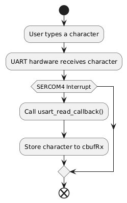
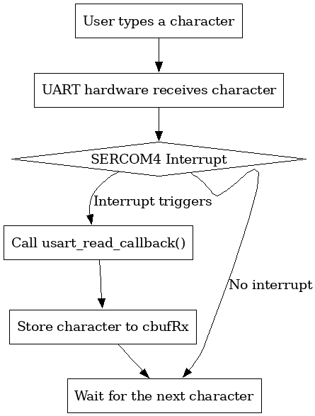

# a07g-exploring-the-CLI

* Team Number:
* Team Name:
* Team Members:
* GitHub Repository URL:
* Description of test hardware: (development boards, sensors, actuators, laptop + OS, etc)

## 1. Software Architecture

### 1. Hardware Requirements Specification (HRS)

5.1	Overview:

The hardware for the Tennis Swing Trajectory Tracker is designed to provide precise data acquisition, efficient processing, and user-friendly interaction. It includes a motion sensor for tracking, a microcontroller for processing and communication, an LCD for real-time feedback, and an SD card for data storage, all integrated into a compact PCB.

5.2	Definitions, Abbreviations

* **ICM-20948**: A 9-axis motion sensor combining accelerometer, gyroscope, and magnetometer.
* **ST7735R**: A full-color LCD module for displaying metrics and simple trajectory simulations.
* **SAMW25**: A microcontroller with built-in Wi-Fi capabilities for processing and data transmission.
* **SD Card**: A removable storage module for saving and retrieving sensor data.
* **Switch Button**: A hardware component to pause sensor recording and activate review mode.
* **PCB**: Printed Circuit Board, used to integrate all hardware components.
* **Li-Ion Battery**: A single-cell battery providing the primary power source.
* **ON/OFF Button**: A hardware component to turn on/off the device.

5.3	Functionality

| **Requirement ID** | **Requirement Description**                                                                         | **Performance Metric**              |
| ------------------------ | --------------------------------------------------------------------------------------------------------- | ----------------------------------------- |
| HRS 01                   | The system shall use the ICM-20948 sensorfor 9-axis motion tracking.                                      | Sensor data sampled at up to 1.1 kHz.     |
| HRS 02                   | The system shall display metrics in real-time using the ST7735R LCD.                                     | Display refresh rate ≥ 30 FPS.           |
| HRS 03                   | The system shall use the SAMW25 microcontroller to manage data processing and Wi-Fi communication.       | Data transmission latency ≤ 100 ms.      |
| HRS 04                   | The hardware shall be powered by a single-cell Li-Ion battery(3.7V nominal voltage).                     | Battery life ≥ 4 hours.                  |
| HRS 05                   | All components shall be integrated into a custom PCB for compact and portable design.                     | PCB dimensions ≤ 500x500 mm.             |
| HRS 06                   | The system shall include Wi-Fi functionality for data transmission via the SAMW25.                        | Wi-Fi range ≥ 10 meters indoors.         |
| HRS 07                   | The hardware shall include an SD card slot for data storage and retrieval.                               | Data write speed ≥ 3 MB/s.              |
| HRS 08                   | The system shall include a switch button to pause sensor recording and activate review mode on the LCD.  | Button response time ≤ 100 ms.           |
| HRS 09                   | The PCB shall include appropriate voltage regulators to provide 3.3V and 5V as needed for all components. | Voltage output variation ≤ ±0.1V.       |
| HRS 10                   | The hardware shall withstand typical tennis swings without detachment or damage.                          | Withstand forces up to 300g acceleration. |

### 2. Software Requirements Specification (SRS)

6.1 Overview

The software for the Tennis Swing Trajectory Tracker processes data from the motion sensor, manages user interactions, and provides real-time feedback on the LCD. It supports pausing data recording, simulating swing trajectories, and storing swing data on an SD card for later analysis. The software also enables wireless data transmission for advanced analysis on external devices.

6.2 Users

**Tennis players**, looking to improve their swing mechanics.
**Coaches**, who want detailed motion data to provide targeted feedback.
**Recreational users**, interested in visualizing and sharing their swing trajectories.

6.3 Definitions, Abbreviations

* **ICM-20948**: The motion sensor providing acceleration, angular velocity, and magnetic field data.
* **LCD**: The ST7735R display module for real-time feedback.
* **SAMW25**: The microcontroller responsible for data processing and Wi-Fi communication.
* **SD Card**: External storage for swing data.
* **Switch Button**: A hardware interface for pausing and resuming data recording.

6.4 Functionality

| **Requirement ID** | **Functionality Description**                                                                         | **Performance Metric**               |
| ------------------------ | ----------------------------------------------------------------------------------------------------------- | ------------------------------------------ |
| SRS 01                   | The system shall collect and process motion data from the ICM-20948 sensor.                                 | Data processing within 100 ms.             |
| SRS 02                   | The software shall display real-time metrics and trajectory simulations on the ST7735R LCD.                 | Metrics updated at 30 FPS.                 |
| SRS 03                   | The system shall pause data recording and display the last recorded data when the switch button is pressed. | Pause functionality response ≤ 100 ms.    |
| SRS 04                   | The software shall store swing data on an SD card for later retrieval.                                      | Write speed ≥ 5 MB/s.                     |
| SRS 05                   | The system shall transmit processed data wirelessly using the SAMW25 microcontroller.                       | Wi-Fi latency ≤ 100 ms.                  |
| SRS 06                   | The software shall retrieve and display previously stored swing data from the SD card.                      | Data retrieval within 200 ms.              |
| SRS 07                   | The software shall indicate system status via the LCD.                                                      | LCD updates within 1 second.               |
| SRS 08                   | The software shall simulate the simple swing trajectory on LCD after click the button.                     | LCD update the trajectory within 3 second |
| SRS 09                   | The computer software shall simulate the 3D version of swing trajectory.                                  | Simulation within 1 mins                   |

 

## 2. Understanding the Starter Code

1. **What does “InitializeSerialConsole()” do? In said function, what is “cbufRx” and “cbufTx”? What type of data structure is it?**
   The `InitializeSerialConsole()` function initializes the serial console by initializing two circular buffers, `cbufRx` and `cbufTx`, using the `circular_buf_init()` function with `rxCharacterBuffer` and `txCharacterBuffer` respectively. It also configures the USART using `configure_usart()`, registers the read and write callbacks using `configure_usart_callbacks()`, sets the interrupt priority for `SERCOM4_IRQn`, and starts a continuous reading process using `usart_read_buffer_job()`. `cbufRx` is a circular buffer handle for receiving characters, and `cbufTx` is a circular buffer handle for transmitting characters.
2. **How are “cbufRx” and “cbufTx” initialized? Where is the library that defines them (please list the \*C file they come from).**
   `cbufRx` is initialized by calling `circular_buf_init((uint8_t *)rxCharacterBuffer, RX_BUFFER_SIZE)`, and `cbufTx` is initialized by calling `circular_buf_init((uint8_t *)txCharacterBuffer, TX_BUFFER_SIZE)`. Based on common practices and the function name, the library that defines `circular_buf_init` and the `cbuf_handle_t` type is likely located in a file named `circular_buffer.c`, although this is not explicitly stated in the provided `SerialConsole.c` file.
3. **Where are the character arrays where the RX and TX characters are being stored at the end? Please mention their name and size.**
   The character arrays where the RX and TX characters are stored are `rxCharacterBuffer` with a size of `RX_BUFFER_SIZE` (defined as 512 bytes) and `txCharacterBuffer` with a size of `TX_BUFFER_SIZE` (defined as 512 bytes).
4. **Where are the interrupts for UART character received and UART character sent defined?**
   The code sets the priority for the `SERCOM4_IRQn` interrupt, which is the interrupt associated with the SERCOM4 peripheral used for UART communication. The specific definition of the interrupt handlers would be in the microcontroller's startup files or within the SERCOM driver implementation. The callbacks `usart_read_callback` and `usart_write_callback` are registered for the `USART_CALLBACK_BUFFER_RECEIVED` and `USART_CALLBACK_BUFFER_TRANSMITTED` events, respectively, in the `configure_usart_callbacks()` function.
5. **What are the callback functions that are called when: A character is received? (RX) A character has been sent? (TX)**
   When a character is received (RX), the `usart_read_callback` function is registered to be called. When a character has been sent (TX), the `usart_write_callback` function is registered to be called.
6. **Explain what is being done on each of these two callbacks and how they relate to the cbufRx and cbufTx buffers.**
   The `usart_read_callback` function is intended to handle the reception of characters. The comment `// ToDo: Complete this function` indicates that the logic to store the received character (likely `latestRx`) into the `cbufRx` buffer needs to be implemented. The `usart_write_callback` function is called when the transmission of a buffer is complete. It checks if there are more characters in the `cbufTx` buffer using `circular_buf_get()`. If there are more characters, it gets the next character and initiates its transmission using `usart_write_buffer_job()`.
7. **Draw a diagram that explains the program flow for UART receive – starting with the user typing a character and ending with how that character ends up in the circular buffer “cbufRx”. Please make reference to specific functions in the starter code.**

   
8. **Draw a diagram that explains the program flow for the UART transmission – starting from a string added by the program to the circular buffer “cbufTx” and ending on characters being shown on the screen of a PC (On Teraterm, for example). Please make reference to specific functions in the starter code.**

   
9. **What is done on the function “startStasks()” in main.c? How many threads are started?**
   The function `StartTasks()` (note the capitalization in the code) is defined in `main.c`. This function first prints the heap size before starting tasks. Then, it creates one FreeRTOS task using `xTaskCreate()`: `vCommandConsoleTask` with the name "CLI\_TASK". After creating this task, it prints the heap size again. Therefore, based on the provided `main.c` code, **one thread** is explicitly started within the `StartTasks()` function.

## 4. Wiretap the convo!

1. Based on the SerialConsole.c code and the SAMW25_XPLAINED_PRO.h file, the UART communication for the EDBG CDC interface uses SERCOM4. The specific pins are defined by:
   EDBG_CDC_SERCOM_PINMUX_PAD2 which corresponds to the Transmit (TX) line,PB10_SERCOM_4. EDBG_CDC_SERCOM_PINMUX_PAD3 which corresponds to the Receive (RX) line.PB11_SERCOM4.
2. From the following figure, we can see we need attach the pin PB10 and PB11.

### 2.**photo of your hardware connections**

### 3.**screenshot of the decoded message**

### 4. **Capture File**

The usart.sal is our capture file.

## 6. **Add CLI commands**

video link: [https://youtu.be/FAAj1BERWvg?si=ajbn2K48HhYb-9YP]()
