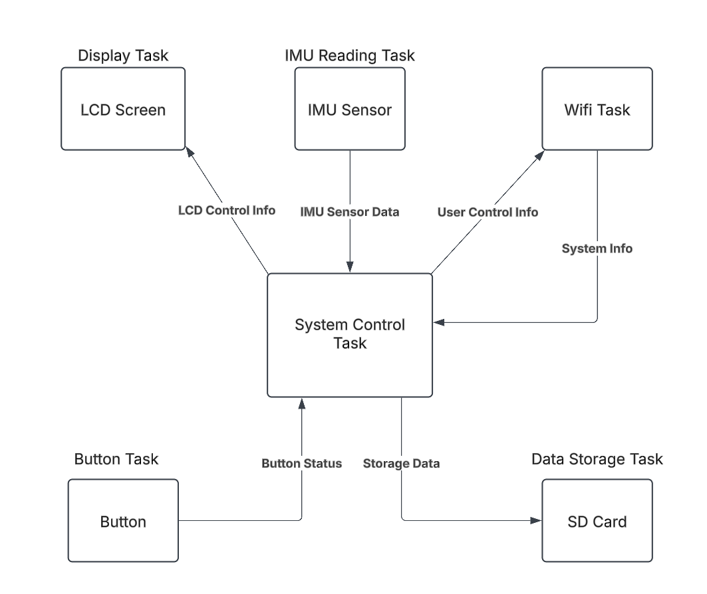
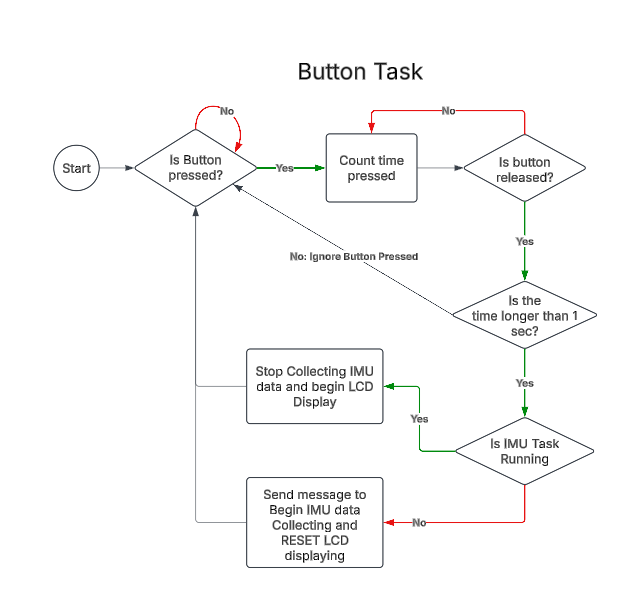
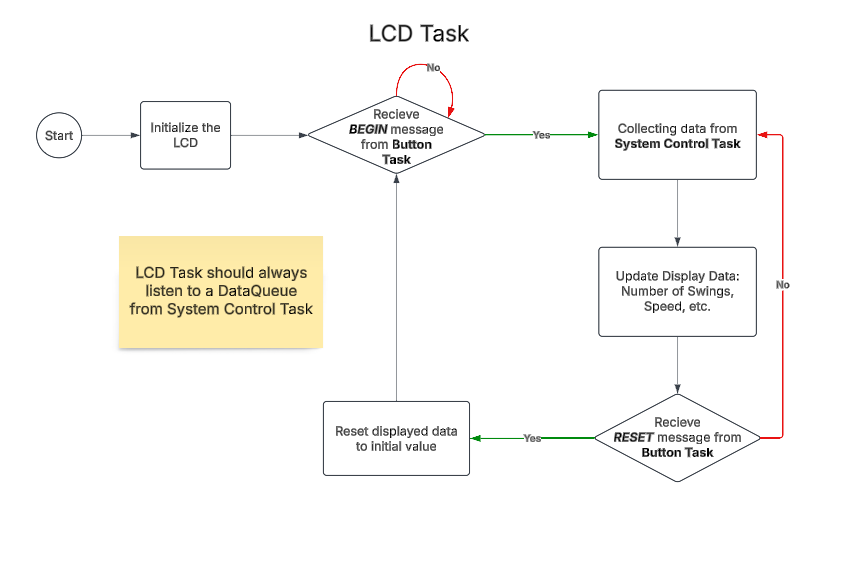
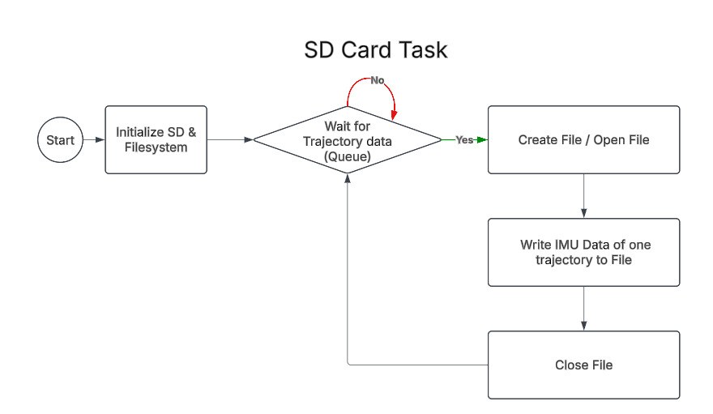
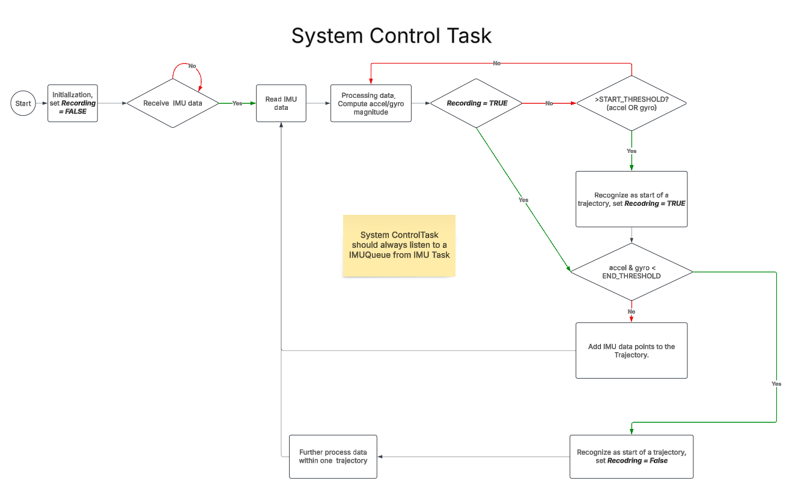
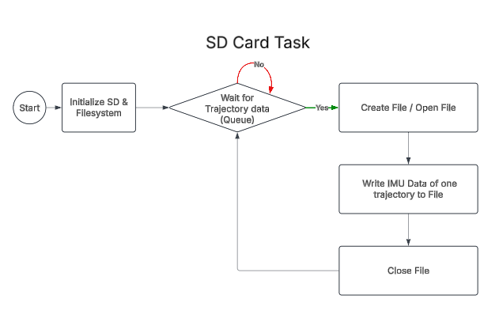
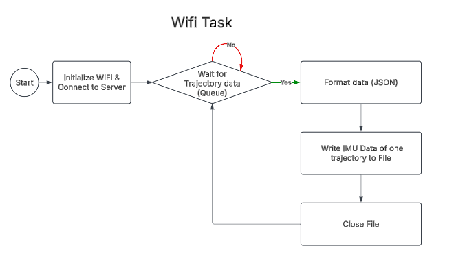
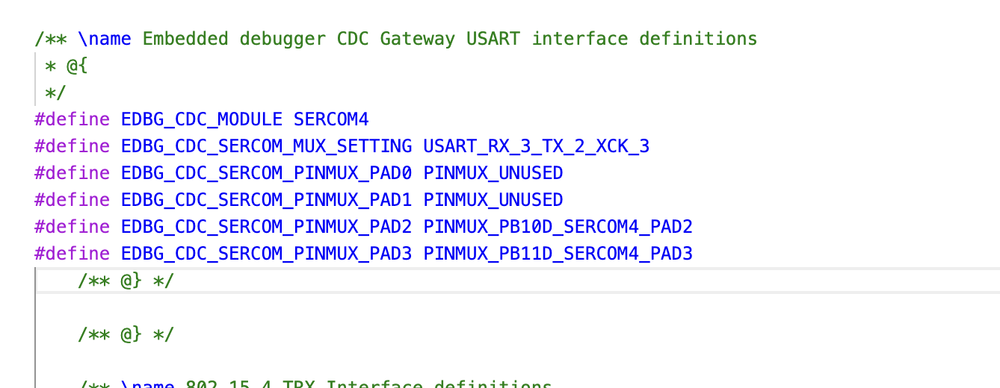
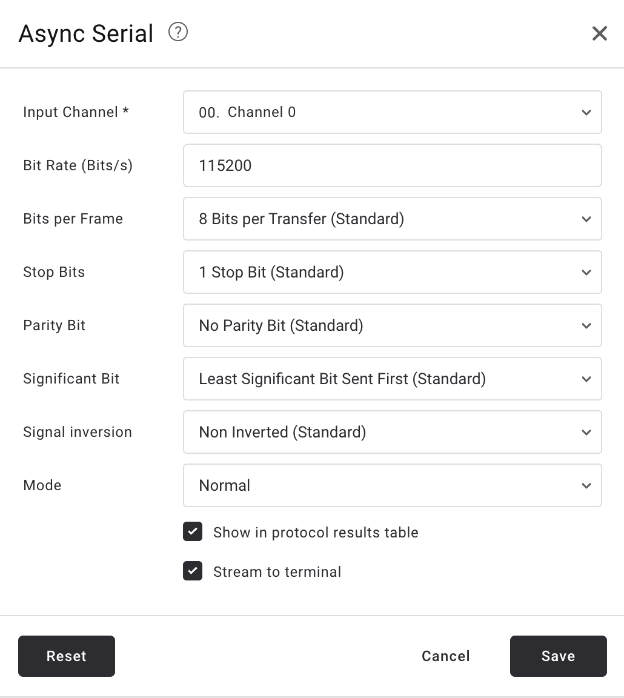
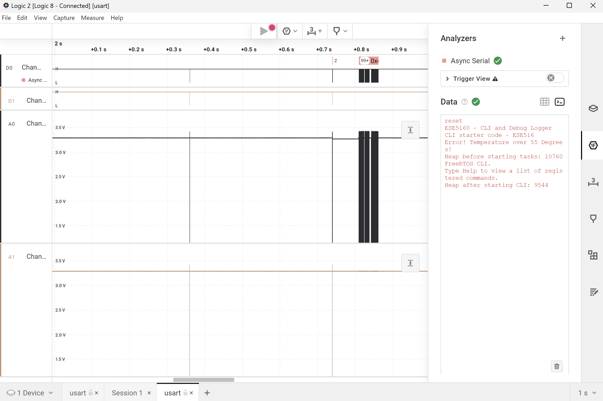

# a07g-exploring-the-CLI

* Team Number:
* Team Name:
* Team Members:
* GitHub Repository URL:
* Description of test hardware: (development boards, sensors, actuators, laptop + OS, etc)

## 1. Software Architecture

### Hardware Requirements Specification (HRS)

5.1	Overview:

The hardware for the Tennis Swing Trajectory Tracker is designed to provide precise data acquisition, efficient processing, and user-friendly interaction. It includes a motion sensor for tracking, a microcontroller for processing and communication, an LCD for real-time feedback, and an SD card for data storage, all integrated into a compact PCB.

5.2	Definitions, Abbreviations

* **ICM-20948**: A 9-axis motion sensor combining accelerometer, gyroscope, and magnetometer.
* **ST7735R**: A full-color LCD module for displaying metrics and simple trajectory simulations.
* **SAMW25**: A microcontroller with built-in Wi-Fi capabilities for processing and data transmission.
* **SD Card**: A removable storage module for saving and retrieving sensor data.
* **Switch Button**: A hardware component to pause sensor recording and activate review mode.
* **PCB**: Printed Circuit Board, used to integrate all hardware components.
* **Li-Ion Battery**: A single-cell battery providing the primary power source.
* **ON/OFF Button**: A hardware component to turn on/off the device.

5.3	Functionality

| **Requirement ID** | **Requirement Description**                                                                         | **Performance Metric**              |
| ------------------------ | --------------------------------------------------------------------------------------------------------- | ----------------------------------------- |
| HRS 01                   | The system shall use the ICM-20948 sensorfor 9-axis motion tracking.                                      | Sensor data sampled at up to 1.1 kHz.     |
| HRS 02                   | The system shall display metrics in real-time using the ST7735R LCD.                                     | Display refresh rate ≥ 30 FPS.           |
| HRS 03                   | The system shall use the SAMW25 microcontroller to manage data processing and Wi-Fi communication.       | Data transmission latency ≤ 100 ms.      |
| HRS 04                   | The hardware shall be powered by a single-cell Li-Ion battery(3.7V nominal voltage).                     | Battery life ≥ 4 hours.                  |
| HRS 05                   | All components shall be integrated into a custom PCB for compact and portable design.                     | PCB dimensions ≤ 500x500 mm.             |
| HRS 06                   | The system shall include Wi-Fi functionality for data transmission via the SAMW25.                        | Wi-Fi range ≥ 10 meters indoors.         |
| HRS 07                   | The hardware shall include an SD card slot for data storage and retrieval.                               | Data write speed ≥ 3 MB/s.              |
| HRS 08                   | The system shall include a switch button to pause sensor recording and activate review mode on the LCD.  | Button response time ≤ 100 ms.           |
| HRS 09                   | The PCB shall include appropriate voltage regulators to provide 3.3V and 5V as needed for all components. | Voltage output variation ≤ ±0.1V.       |
| HRS 10                   | The hardware shall withstand typical tennis swings without detachment or damage.                          | Withstand forces up to 300g acceleration. |

### Software Requirements Specification (SRS)

6.1 Overview

The software for the Tennis Swing Trajectory Tracker processes data from the motion sensor, manages user interactions, and provides real-time feedback on the LCD. It supports pausing data recording, simulating swing trajectories, and storing swing data on an SD card for later analysis. The software also enables wireless data transmission for advanced analysis on external devices.

6.2 Users

**Tennis players**, looking to improve their swing mechanics.
**Coaches**, who want detailed motion data to provide targeted feedback.
**Recreational users**, interested in visualizing and sharing their swing trajectories.

6.3 Definitions, Abbreviations

* **ICM-20948**: The motion sensor providing acceleration, angular velocity, and magnetic field data.
* **LCD**: The ST7735R display module for real-time feedback.
* **SAMW25**: The microcontroller responsible for data processing and Wi-Fi communication.
* **SD Card**: External storage for swing data.
* **Switch Button**: A hardware interface for pausing and resuming data recording.

6.4 Functionality

| **Requirement ID** | **Functionality Description**                                                                         | **Performance Metric**               |
| ------------------------ | ----------------------------------------------------------------------------------------------------------- | ------------------------------------------ |
| SRS 01                   | The system shall collect and process motion data from the ICM-20948 sensor.                                 | Data processing within 100 ms.             |
| SRS 02                   | The software shall display real-time metrics and trajectory simulations on the ST7735R LCD.                 | Metrics updated at 30 FPS.                 |
| SRS 03                   | The system shall pause data recording and display the last recorded data when the switch button is pressed. | Pause functionality response ≤ 100 ms.    |
| SRS 04                   | The software shall store swing data on an SD card for later retrieval.                                      | Write speed ≥ 5 MB/s.                     |
| SRS 05                   | The system shall transmit processed data wirelessly using the SAMW25 microcontroller.                       | Wi-Fi latency ≤ 100 ms.                  |
| SRS 06                   | The software shall retrieve and display previously stored swing data from the SD card.                      | Data retrieval within 200 ms.              |
| SRS 07                   | The software shall indicate system status via the LCD.                                                      | LCD updates within 1 second.               |
| SRS 08                   | The software shall simulate the simple swing trajectory on LCD after click the button.                     | LCD update the trajectory within 3 second |
| SRS 09                   | The computer software shall simulate the 3D version of swing trajectory.                                  | Simulation within 1 mins                   |

### Flow Charts














 

## 2. Understanding the Starter Code


1. The InitializeSerialConsole() function initializes the serial communication for the CLI and Debug Logger by setting up the UART to operate at 115200 8N1, configuring it using configure_usart(), and registering callback functions for UART events with configure_usart_callbacks(); within this function, cbufRx and cbufTx are circular buffer handlers, which are pointers to the circular_buf_t structure defined in circular_buffer.c, representing a circular buffer data structure used for asynchronous read and write operations.
2. cbufRx and cbufTx are initialized by calling the circular_buf_init() function, with cbufRx using the rxCharacterBuffer and its size RX_BUFFER_SIZE, and cbufTx using the txCharacterBuffer and TX_BUFFER_SIZE; the library that defines circular_buf_init() and the circular buffer structure is located in the circular_buffer.c file.
3. The character arrays where the RX and TX characters are stored are named rxCharacterBuffer and txCharacterBuffer, respectively, and both have a size of 512 bytes, as defined by the RX_BUFFER_SIZE and TX_BUFFER_SIZE macros in SerialConsole.c.
4. The interrupts for UART character received and sent are defined in the startup_samd21.c file within the interrupt vector table, where the SERCOM4_Handler is mapped to the SERCOM4 interrupt;
5. Based on the starter code, the callback function that is called when a character is received (RX) is usart_read_callback. The callback function that is called when a character has been sent (TX) is usart_write_callback.
6. The usart_read_callback function is intended to be executed when the UART hardware receives a character. Its primary role is to take the received character and store it in the receive circular buffer, cbufRx, so that it can be processed later by other parts of the system, such as the command-line interface (CLI) thread. The A07G Exploring the CLI S25.docx file notes that this callback needs to be implemented to store incoming characters in a ring buffer for the CLI thread to use. On the other hand, the usart_write_callback function is called when the UART finishes transmitting a character. Its function is to check if there are more characters waiting to be sent in the transmit circular buffer, cbufTx. If cbufTx is not empty, this callback retrieves the next character from it and initiates the UART transmission process for that character, ensuring a continuous flow of data being sent out.
7. .
8. .
9. The StartTasks() function in main.c is responsible for initializing application tasks. In the provided code, it initializes one thread by calling the FreeRTOS function xTaskCreate() to create a task named "CLI_TASK" that executes the vCommandConsoleTask function.


## 3. Debug Logger Module

See the `SerialConsole.c`

```
void LogMessage(enum eDebugLogLevels level, const char *format, ...)
{
    // Todo: Implement Debug Logger
	// More detailed descriptions are in header file
	if(level<currentDebugLevel) return; // Filter non-important messages

	char buffer[256]; // buffer
	va_list args; // Create Variable list
	va_start(args, format);
	vsprintf(buffer,format,args);// Put all the args as format into buffer
	va_end(args);

	SerialConsoleWriteString(buffer); // Output the format buffer to serial console

}
```

## 4. Wiretap the convo!

1. Based on the SerialConsole.c code and the SAMW25_XPLAINED_PRO.h file, the UART communication for the EDBG CDC interface uses SERCOM4. The specific pins are defined by:
   EDBG_CDC_SERCOM_PINMUX_PAD2 which corresponds to the Transmit (TX) line,PB10_SERCOM_4. EDBG_CDC_SERCOM_PINMUX_PAD3 which corresponds to the Receive (RX) line.PB11_SERCOM4.
2. From the following figure, we can see we need attach the pin PB10 and PB11.





### **Photo of Hardware Connections**


### **screenshot of the decoded message**



### **Capture File**

See the usart.sal file in github

## 5.  Complete the CLI

See the `SerialConsole.c` and ` CliThread.c`

```
static void FreeRTOS_read(char *character)
{
    // ToDo: Complete this function
    if (xSemaphoreTake(xRxSemaphore, portMAX_DELAY) == pdTRUE) // read until receive a character 
    {
	    //read the character
	    SerialConsoleReadCharacter((uint8_t *)character);
    }
}

```

```
void usart_read_callback(struct usart_module *const usart_module)
{
	// ToDo: Complete this function 
	circular_buf_put(cbufRx, (uint8_t)latestRx);  // put the char into circular buffer
	usart_read_buffer_job(&usart_instance, (uint8_t *)&latestRx, 1);  //Re-initiate the read for the next incoming byte

	BaseType_t xHigherPriorityTaskWoken = pdFALSE;
	xSemaphoreGiveFromISR(xRxSemaphore, &xHigherPriorityTaskWoken); // Give the semaphore from ISR
	portYIELD_FROM_ISR(xHigherPriorityTaskWoken);  // Increase the priority to deal with the serial command

}
```

## 6. **Add CLI commands**

See the ` CliThread.c`

Function: `CLI_Version` and `CLI_Ticks`

video link: [https://youtu.be/FAAj1BERWvg?si=ajbn2K48HhYb-9YP]()
